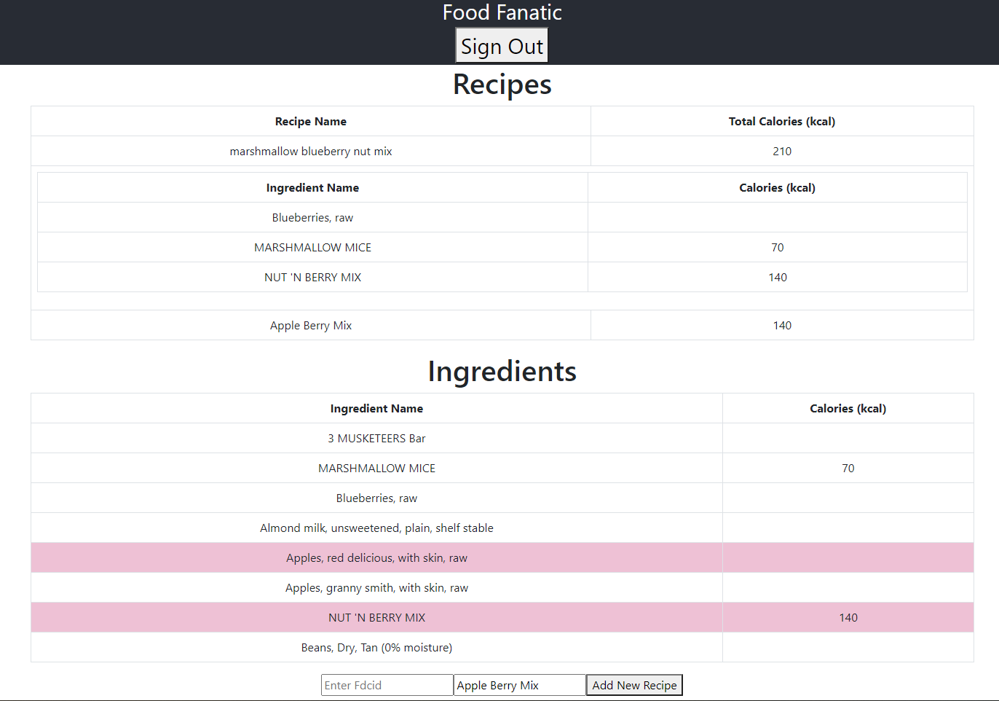

# Food Fanatic
#### EC463 SW Mini-Project: Michael Harkess and John Mikulskis

## Running the code
In the food-fanatic folder, run `npm install` and `npm i react-webcam-barcode-scanner` to install the necessary libraries. The run `npm start` to start the server, and then in the client folder run `npm start` for the React frontend

## API
Our API uses a get request to grab data from the fdc api and output human readable information about a food product
After scanning a barcode, you can pass the UPC value to our backend

* **/ingredient**

* **Method:**
  
  `GET`
  
*  **URL Params**

   **Required:**
 
   `fdcID={fdcId}`

* **Success Response:**

  * **Code:** 200  
    **Content:** `{ name : NAME, cal: CALORIES }`
 
* **Error Response:**

  * **Code:** 400 Bad Request 
    **Content:** `{ name : null, cal: null }`

## User experience
The user can login with google, which is set up with firebase. Any ingredients or recipes they add are stored in firestore in a collection associated with their user ID

The frontend displays the ingredients and recipes that the user has added. You can select ingredients and add them to a new recipe, which will then display in the recipes table along with the total number of calories. If you click on a recipe it will expand to show the ingredients

* **Youtube Link:**
https://youtu.be/EMj4i927zFU
*Note Turn down volume when playing as I didn't realize the mic was on full blast until after it was published...

